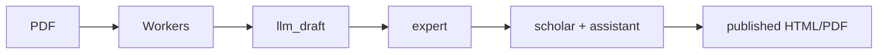
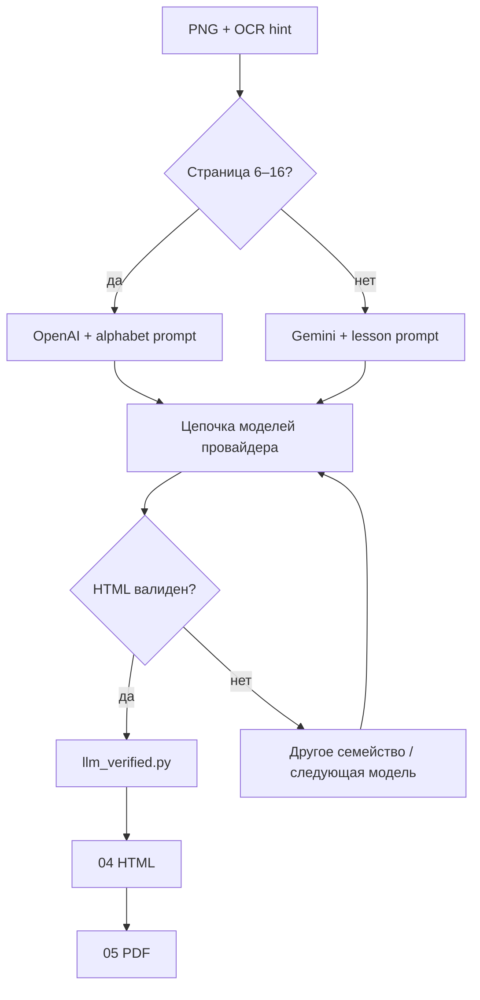

# Sanskrit SRV — MVP набросок

Сервис для оцифровки и экспертной правки санскритских **рукописей и изданий** (Devanagari + опционально English-комментарии): от PDF-скана до выверенного HTML/PDF.

> Статус: **набросок для обсуждения**. Код — каркас, не production.
> Опора: рабочие пайплайны `infant_reader_ocr/` и `sabda_manjari_ocr/` в родительском репозитории.

**План «на пальцах» для индолога (не IT):** [`docs/plan-for-indologists.md`](docs/plan-for-indologists.md)

---

## Проблема

1. Сканы учебников (Infant Reader, Sabda Manjari и т.п.) часто с skew, bleed-through, без текстового слоя.
2. OCR (Tesseract) по Devanagari даёт шум; LLM vision хорошо делает черновик, но ошибается на таблицах и «думает вслух».
3. Нужны **два уровня человека**: техэксперт (сверка со сканом) и учёный (филология) — с LLM-ассистентом по директивам, не руками в HTML.

---

## Ценностное предложение

| Для кого | Ценность |
|----------|----------|
| Центр / издательство | Стандартизированный процесс: скан → черновик → два прохода экспертов → публикация |
| Техэксперт | Side-by-side скан + HTML; LLM только черновик |
| Учёный | Директивы на естественном языке → diff → принять/отклонить |
| Читатель | Читаемые HTML/PDF с нормальными шрифтами Devanagari |

---

## MVP: что входит / что нет

### Входит (MVP)

- Загрузка PDF → извлечение страниц → OCR → LLM-черновик (фон, Celery)
- Auth: JWT + роли `admin | expert | scholar | reader`
- Workflow по **страницам** (не только по книге)
- Экран эксперта: скан | редактор HTML
- Экран учёного: директива → LLM → diff → approve
- Версии контента страницы + комментарии
- Экспорт HTML/PDF (переиспользовать CSS/WeasyPrint из пайплайна)

### Не входит (позже)

- Биллинг / multi-tenant SaaS
- EPUB / мобильные приложения
- Полный WYSIWYG с таблицами как в InDesign
- Автосогласование между экспертами (merge conflicts UI)
- Каталог опубликованных книг для публики

---

## Роли и workflow

```
uploaded → extracting → ocr → llm_draft
       → expert_review → expert_done
       → scholar_review → published
              ↑
         (откат / переоткрытие)
```

| Роль | Действия |
|------|----------|
| **admin** | проекты, пользователи, ключи LLM, деплой |
| **expert** | правка HTML по скану, «принять страницу», re-run LLM |
| **scholar** | директивы ассистенту, accept/reject diff, финальное «опубликовать» |
| **reader** | только `published` |

Каждая страница — отдельный статус. Книга `published`, когда все страницы в `published` (или admin принудительно).



---

## Два экрана MVP

### 1. Expert — side-by-side

```
┌──────────────────┬─────────────────────────────┐
│ Scan (PNG)       │ HTML fragment               │
│ zoom / pan       │ TipTap / textarea           │
│                  │ [Сохранить] [LLM снова]     │
│                  │ [✓ Сдать учёному]           │
└──────────────────┴─────────────────────────────┘
```

### 2. Scholar — директивы + diff

```
┌────────────────────────────────────────────────┐
│ Текущий текст (после эксперта)                 │
├────────────────────────────────────────────────┤
│ Директива: «в стр.3 замени अयम् на एषः»       │
│ [Отправить ассистенту]                         │
├────────────────────────────────────────────────┤
│ Diff: - अयम् … / + एषः …                       │
│ [Принять] [Отклонить] [Уточнить]               │
└────────────────────────────────────────────────┘
```

Учёный **не обязан** править HTML вручную; ассистент применяет директиву к фрагменту страницы.

---

## Текущая архитектура

Сейчас работают **два слоя**: (1) проверенный локальный пайплайн оцифровки и (2) каркас веб-сервиса `sanskrit_srv`, который ещё не оркестрирует пайплайн в проде.

### 1. Локальный пайплайн (источник истины по обработке)

Реализован в соседних каталогах (`infant_reader_ocr/`, аналогично `sabda_manjari_ocr/`):

```text
PDF-скан
  → 01 extract pages (PNG)
  → 02 OCR (Tesseract)
  → 07 LLM verify (ProxyAPI vision)  ← черновик HTML
  → 04 build HTML → 05 build PDF
```

**Оркестрация LLM сегодня** — скрипт `07_llm_verify.py` (не Celery):

| Шаг | Что происходит |
|-----|----------------|
| Тип страницы | Хардкод Infant Reader: стр. **6–16** = alphabet, остальное = lesson |
| Промпт | `ALPHABET_PROMPT` или `SYSTEM_PROMPT` |
| Старт провайдера (`--provider auto`) | alphabet → **OpenAI**; lesson → **Gemini** |
| Цепочка моделей | внутри семейства: primary → fallbacks (Flash / GPT) |
| Валидация | `html_utils.is_garbage_html` (reasoning, truncation, мало Devanagari) |
| Смена семейства | при провале — Gemini ↔ OpenAI |
| Если LLM не выдал | при сборке HTML — OCR fallback + пометка |



**Модели черновика (эмпирика Infant Reader):** детали в [`docs/llm_routing.md`](docs/llm_routing.md).

| Тип | Primary | Fallback |
|-----|---------|----------|
| Уроки / проза | gemini-3.5-flash | gemini-2.5-flash → gpt-4o-mini |
| Длинные таблицы / TOC | gemini-2.5-flash | gemini-3.5-flash |
| Алфавитные сетки | gpt-4o-mini | gpt-4o |
| Плотные conjuncts / титул | LLM только draft / seed | эксперт |

Шлюз: **ProxyAPI.ru** (`/google` + `/openai/v1`), один ключ.

### 2. Каркас сервиса `sanskrit_srv` (сейчас)

```
sanskrit_srv/
├── README.md
├── docs/          ← план, схема, API, LLM routing, план для индолога
├── backend/       ← FastAPI + SQLAlchemy эскиз + placeholder workers
├── frontend/      ← placeholder
└── docker-compose.yml   ← postgres + redis + api + worker (заготовка)
```

| Уже есть | Ещё нет |
|----------|---------|
| Описание ролей и статусов страниц | Реальная очередь Celery вокруг пайплайна |
| Эскиз БД / API | Auth UI, expert/scholar экраны |
| Документ routing LLM | `page_type` в settings вместо хардкода номеров |
| План для индолога | Production-деплой, MinIO, биллинг |

Связь «пайплайн → сервис» (целевая):

| Модуль сейчас | В сервисе |
|---------------|-----------|
| `01_extract_pages.py` | worker `extract_pages` |
| `02_ocr.py` | worker `ocr_page` |
| `07_llm_verify.py` (`auto`) | worker `llm_verify_page` |
| `html_utils.py` | валидация ответов LLM |
| `04` / `05` build | export HTML/PDF |
| `llm_verified.py` | `page_versions` |

---

## Набросок обобщения

Цель: та же логика Infant Reader, но **для любой рукописи/издания**, без хардкода «страницы 6–16».

### Принципы

1. **Страница — единица workflow** (статус, версии, assignee), книга — агрегат.
2. **`page_type` вместо номеров PDF** — классификатор (эвристика / ручная метка / лёгкая модель): `title | alphabet | toc | lesson | prose | unknown`.
3. **Routing LLM в `project.settings` (JSONB)** — матрица primary/fallback/prompt/max_tokens; не в коде.
4. **Один шлюз ProxyAPI**, два семейства (Gemini / OpenAI); внутри — цепочки моделей; между — failover.
5. **Валидация обязательна** перед записью версии; провал → следующая модель → expert queue.
6. **Alphabet / grid всегда `expert_review`** даже при «успешном» HTML.
7. **Учёный правит директивами**, не обязан трогать разметку; audit trail директив и diff.
8. **Экспорт** переиспользует проверенный CSS/WeasyPrint; EN-комментарии — опциональный слой поверх утверждённого текста.

### Целевая оркестрация (сервис)


Черновик конфига routing — в [`docs/llm_routing.md`](docs/llm_routing.md) (блок YAML). Эскиз сущностей — [`docs/schema.md`](docs/schema.md). План без IT-жаргона — [`docs/plan-for-indologists.md`](docs/plan-for-indologists.md).

### Что обобщать в первую очередь (порядок работ)

| # | Шаг обобщения | Зачем |
|---|----------------|-------|
| 1 | Вынести routing + промпты в settings проекта | разные книги ≠ Infant Reader |
| 2 | Обернуть 01/02/07 в Celery tasks | фон, ретраи, статусы страниц |
| 3 | Версии HTML в БД вместо `llm_verified.py` | audit, rollback |
| 4 | Expert UI (скан \| текст) | закрыть разрыв «скрипт → человек» |
| 5 | Scholar directives + diff | филология без правки HTML |
| 6 | Export + published | результат для архива / читателя |

До этого каркас сервиса остаётся **документом + заготовкой**; рабочий контур обработки — локальные OCR/LLM-пайплайны.

---

## Стек MVP

| Слой | Выбор | Почему |
|------|-------|--------|
| API | FastAPI | уже Python-пайплайн |
| Очередь | Celery + Redis | длинные OCR/LLM |
| БД | PostgreSQL | версии, роли, JSON HTML |
| Файлы | local `storage/` → MinIO позже | простота MVP |
| Auth | JWT + bcrypt | без Keycloak на старте |
| UI | Next.js **или** SvelteKit | обсудить |
| PDF | WeasyPrint | уже работает |
| LLM | ProxyAPI Gemini/GPT | проверено на Infant Reader |

---

## Оценка

| Этап | Срок (1 разработчик) | Результат |
|------|----------------------|-----------|
| A. Workers + БД + API upload/pages | 2–3 нед. | импорт Infant Reader demo |
| B. Auth + expert UI | 2 нед. | side-by-side правка |
| C. Scholar + assistant | 2–3 нед. | директивы → diff |
| D. Export + polish | 1 нед. | HTML/PDF publish |
| **Итого MVP** | **~7–9 недель** | один проект, два уровня экспертизы |

---

## Риски (для обсуждения)

1. LLM не заменяет учёного — только ускоряет; нужен audit trail директив.
2. Сложные таблицы (алфавит) — гибрид: шаблоны + LLM / GPT fallback (уже показали).
3. Редактор Devanagari + таблицы в браузере — не trivial; на MVP допустим HTML-source + preview.
4. Стоимость API ~$1–5 на книгу 100 стр.; квоты на проект.
5. Юридически: права на PDF-источники, роли экспертов.

---

## LLM: кто «не напутал» (Infant Reader)

Детали: [`docs/llm_routing.md`](docs/llm_routing.md).

| Тип страницы | Лучший черновик | Надёжность содержания |
|--------------|-----------------|------------------------|
| Уроки / проза | **gemini-3.5-flash** | высокая |
| Длинные таблицы | **gemini-2.5-flash** (retry) | средняя |
| Алфавитные сетки | **gpt-4o-mini** (полный HTML) | **низкая** — всегда expert |
| Conjuncts / плотные лигатуры | LLM только draft | нужна ручная/эксперт |

Одна «волшебная» модель не нашлась: нужен **routing по `page_type`**.

## Вопросы к совету

1. Фокус MVP: **внутренний tool** (один центр) или сразу **SaaS**?
2. Главный язык UI: русский / английский / оба?
3. Достаточно ли HTML-source у эксперта, или нужен WYSIWYG с первого дня?
4. Интеграция с уже выверенными книгами (Sabda Manjari) — импорт или только новые?
5. Кто владеет опубликованным текстом / лицензии?

---

## Demo-путь (когда начнём кодировать)

1. Импорт артефактов из `infant_reader_ocr/` (pages PNG + `llm_verified`) как seed проекта.
2. Expert правит 2–3 страницы в UI.
3. Scholar даёт одну директиву, принимает diff.
4. Export HTML/PDF.

До этого — обсуждение этого README и файлов в `docs/`.
