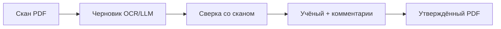

# План сервиса «на пальцах»
## Восстановление санскритских рукописей (и изданий) в читаемый PDF с участием эксперта

Документ для **индолога / филолога**, который понимает веб-хостинг, облачные сервисы и LLM, но не обязан быть программистом.  
Технические детали для разработчиков — в [`README.md`](../README.md), [`schema.md`](schema.md), [`api.md`](api.md).

---

## 1. Зачем это нужно (простыми словами)

Сейчас типичная картина:

1. Есть **скан** рукописи или старого издания (PDF/фото): буквы видны глазу, но компьютер «не читает» текст как текст.
2. Автоматическое распознавание (OCR) по деванагари **шумит**: путает похожие акшары, ломает таблицы, пропускает лигатуры.
3. Большая языковая модель (LLM) может дать **хороший черновик**, но **не заменяет** учёного: она ошибается на редких формах, комментариях, шастрах и «додумывает».

**Цель сервиса:** превратить скан в **выверенный цифровой текст** (HTML) и **красивый PDF** для чтения/публикации, где:

- машина делает тяжёлую черновую работу;
- **эксперт** сверяет со сканом и отвечает за филологическую корректность;
- по желанию добавляются **английские комментарии** (перевод, примечания, аппарат).

Упор именно на **восстановление текста рукописи/издания**, а не на «чат с ИИ ради чата».

---

## 2. Что получится на выходе

| Артефакт | Зачем |
|----------|--------|
| **Скан страниц** (картинки) | всегда рядом с текстом — источник истины |
| **Выверенный текст** (Devanagari, при необходимости + латиница IAST) | поиск, цитирование, дальнейшая работа |
| **Комментарии EN** (опционально) | пояснения, перевод фрагментов, заметки редактора |
| **PDF издания** | то, что можно отдать читателю / в репозиторий / в печать |

Аналогия: сервис — это **цифровая «скриптория»**: переписчик-машина + сверщик-человек + финальный лист (PDF).

---

## 3. Кто участвует (роли без IT-жаргона)

| Роль | Кто это в реальности | Что делает |
|------|----------------------|------------|
| **Администратор** | куратор проекта / техкоординатор | создаёт проект, приглашает людей, следит за квотами LLM |
| **Техэксперт** | человек, умеющий сверять текст со сканом (может быть ассистент) | правит черновик, смотря на картинку страницы |
| **Учёный (scholar)** | индолог / филолог | даёт указания («исправь это чтение», «добавь примечание»), принимает или отклоняет правки, утверждает страницу |
| **Читатель** | коллега, студент, публика | видит только **утверждённые** страницы / готовый PDF |

Важно: учёный **не обязан** править «код страницы» руками. Он пишет **директиву на нормальном языке** (русском или английском), ассистент предлагает изменение, учёный говорит «принять» или «нет».

---

## 4. Как идёт работа над одной рукописью

Представьте книгу из 100 страниц. Каждая страница проходит свой путь:

```text
PDF-скан
   → нарезка на страницы-картинки
   → автоматическое распознавание (черновик)
   → черновик от LLM (улучшение Devanagari / структуры)
   → сверка техэкспертом (скан слева, текст справа)
   → правка учёным (директивы + комментарии EN)
   → страница «утверждена»
   → когда нужно — сборка всей книги в PDF
```

Книга считается **готовой к публикации**, когда нужные страницы утверждены (обычно все, либо выбранный диапазон для пробного выпуска).



---

## 5. Что делает LLM, а что — только эксперт

| Делает машина (LLM / OCR) | Делает только человек |
|---------------------------|------------------------|
| Первичный набор текста со страницы | Окончательное чтение трудных мест |
| Выравнивание очевидного мусора OCR | Выбор между вариантами рукописи / изданий |
| Черновик структуры (абзац, стих, таблица) | Филологический аппарат, атрибуция |
| Предложение правки по директиве учёного | Решение «принять / отклонить» |
| Черновик английского комментария (если попросите) | Ответственность за смысл комментария |

**Правило проекта:** LLM — ускоритель и черновик; **подпись учёного** — критерий истины для публикации.

---

## 6. Как это выглядит «в браузере» (два рабочих места)

### А. Экран сверки (техэксперт)

- Слева: фото страницы (можно увеличить).
- Справа: текст в удобном виде (Devanagari).
- Кнопки: сохранить, «переспросить модель», «сдать учёному».

### Б. Экран учёного

- Текущий текст страницы.
- Поле: «что сделать» — например:  
  *«В строке 3 замени чтение X на Y по скану; добавь EN footnote: …»*
- Система показывает **разницу** (было / стало).
- Учёный: **Принять** / **Отклонить** / **Уточнить директиву**.

Так сохраняется **история**: кто что сказал модели и что вошло в издание.

---

## 7. Где это «живёт» (хостинг без лишней магии)

Вам достаточно понимать три слоя — как у обычного сайта:

| Слой | Аналогия | Зачем |
|------|----------|--------|
| **Сайт (веб-интерфейс)** | «лицо» сервиса в браузере | загрузка PDF, экраны эксперта и учёного |
| **Сервер приложений** | «офис» | учёт проектов, пользователей, статусов страниц |
| **Фоновые работники** | «мастерская» | долгие задачи: нарезка PDF, OCR, вызов LLM, сборка PDF |
| **Хранилище файлов** | «архив» | исходные сканы, картинки страниц, готовые PDF |
| **База данных** | «картотека» | кто утвердил страницу, версии текста, комментарии |

На старте всё может стоять на **одном небольшом облачном сервере** (как обычный VPS) + ключ к LLM-провайдеру.  
Позже — отдельное хранилище файлов и запас по мощности, если рукописей много.

Оплата примерно такая:

- **сервер** — помесячно (хостинг);
- **LLM** — за объём страниц (примерно порядка долларов на сотню страниц — зависит от модели и качества скана);
- **люди** — основное время эксперта и учёного.

---

## 8. Минимальный путь «сделать сервис» (этапы)

Не «всё сразу», а четыре понятных шага:

### Этап A — Мастерская без красивого сайта
- Загрузка PDF, нарезка, OCR, LLM-черновик уже как **очереди задач**.
- Результат можно смотреть хотя бы в простом виде.
- **Критерий успеха:** одна демо-рукопись/учебник проходит автообработку.

### Этап B — Сверка со сканом
- Вход по логину, роли.
- Экран «картинка | текст».
- **Критерий успеха:** эксперт может сдать 5–10 страниц учёному.

### Этап C — Учёный и комментарии
- Директивы → предложение правки → принять/отклонить.
- Поле английского комментария / примечания к странице или фрагменту.
- **Критерий успеха:** учёный утверждает главу без ручного «копания» в разметке.

### Этап D — Издание
- Сборка HTML + **PDF** (шрифты Devanagari, оглавление по возможности).
- Статус «опубликовано», скачивание.
- **Критерий успеха:** один полный PDF, который вы готовы показать коллегам.

Ориентир по календарю при одном разработчике рядом с заказчиком: **порядка 2 месяцев** до рабочего MVP (см. README) — при условии, что пайплайн OCR/LLM уже обкатан на ваших материалах (у нас так и есть на учебниках).

---

## 9. Что сознательно не обещаем в первой версии

- Полную замену палеографии и критического издания «одной кнопкой».
- Идеальный набор сложных таблиц/схем без глаз эксперта.
- Публичный магазин книг и оплату подписки (можно добавить позже).
- Автоматическое «согласие» нескольких учёных без процедуры (конфликты правок — отдельно).

---

## 10. Практический чеклист для запуска пилота

1. Выбрать **одну** рукопись или издание (50–150 стр.) с понятными правами на использование скана.
2. Назначить **одного** техэксперта и **одного** учёного.
3. Зафиксировать правило: *что считается «утверждённым чтением»* (только скан? скан + печатное издание? аппарат вариантов?).
4. Решить: нужны ли **английские комментарии** сразу или второй проход.
5. Арендовать простой сервер + ключ LLM; поставить сервис (Docker — «коробка», которую поднимает техспециалист).
6. Прогнать 10 страниц вручную по полному циклу до PDF.
7. Только потом масштабировать на весь том.

---

## 11. Как это связано с кодом `sanskrit_srv`

Этот репозиторий — **каркас** будущего сервиса:

- описание ролей и статусов страниц;
- заготовка API и базы;
- очередь фоновых задач (OCR / LLM / сборка);
- опора на уже работающие локальные пайплайны оцифровки.

Для индолога достаточно помнить:  
**скан → черновик → сверка → учёный → PDF**, а LLM всегда под контролем эксперта.

---

## 12. Вопросы, которые стоит решить до гранта / подрядчика

1. Рукописи только «внутренние» или сервис для нескольких центров?
2. Язык интерфейса: русский, английский или оба?
3. Комментарии EN — свободные примечания или жёсткий шаблон (перевод / аппарат / глоссарий)?
4. Кто юридически владеет выверенным текстом и PDF?
5. Нужен ли публичный просмотр или только закрытая рабочая группа?

Ответы на них не требуют знания Python — но от них зависит, каким будет MVP.
