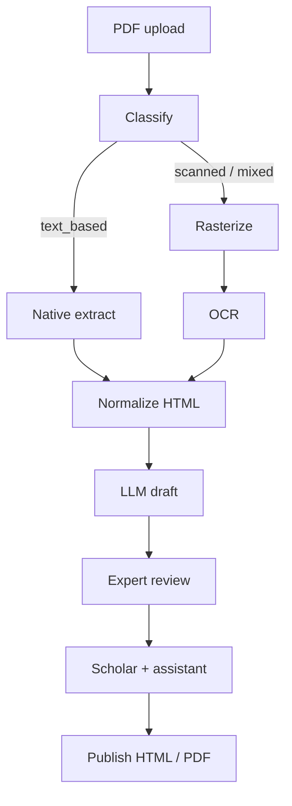

# Тулсет: сервис по сканам санскрита

Рабочий набор инструментов для пайплайна  
**PDF → классификация → OCR / extract → LLM-черновик → эксперт → учёный → HTML/PDF**.

Опора: `sabda_manjari_ocr/`, `infant_reader_ocr/`, `dhaturupa_manjari/`, каркас `sanskrit_srv/`.  
Статус: **черновик тулсета** (не зафиксированный прод-стек).

---

## 1. Слои тулсета



| Слой | Задача | Инструмент | Где уже есть |
|------|--------|------------|--------------|
| **A. Ingest** | принять PDF, метаданные, хеш | FastAPI + local FS / позже MinIO | `sanskrit_srv` каркас |
| **B. Classify** | text / scanned / mixed, OCR-routing | **pdf-inspector** | в venv Sabda, ещё не в коде |
| **C. Raster** | PNG страниц для OCR и UI | **PyMuPDF** | все три пайплайна |
| **D. Preprocess** | crop, grayscale, contrast | **Pillow** | Infant: crop 6% |
| **E. OCR** | Devanagari + eng | **Tesseract** `san+eng` via pytesseract | все пайплайны |
| **F. Extract** | текст из цифровых PDF → MD/HTML | **pdf-inspector** (+ fallback PyMuPDF) | проверено на `ललिता.pdf` |
| **G. Normalize** | правила Devanagari, таблицы | Python rules / BS4 / lxml | `03_fix_ocr.py` и др. |
| **H. LLM draft** | vision-черновик по скану | **httpx** → ProxyAPI (Gemini / OpenAI) | `infant_reader_ocr/07_llm_verify.py` |
| **I. Validate** | HTML sanity, доля деванагари | свои валидаторы | Infant Reader |
| **J. Store** | проекты, страницы, версии | **PostgreSQL** + SQLAlchemy | модели-набросок |
| **K. Jobs** | фон: extract/OCR/LLM/export | **Celery + Redis** | compose stub |
| **L. Review UI** | скан ‖ HTML, diff | TipTap / textarea (план) | ещё нет |
| **M. Export** | читаемый HTML/PDF | **WeasyPrint** + CSS пайплайнов | Sabda/Dhatu/Infant |
| **N. Auth** | роли admin/expert/scholar/reader | JWT + bcrypt | в requirements, не в коде |

---

## 2. Закрепляемые пакеты

### Worker / pipeline (`requirements-workers.txt`)

| Пакет | Зачем |
|-------|--------|
| `pdf-inspector` | классификация + extract text/MD без OCR |
| `pymupdf` | рендер сканов, запасной extract |
| `pillow` | препроцесс изображений |
| `pytesseract` | обёртка Tesseract |
| `beautifulsoup4`, `lxml` | правка HTML |
| `weasyprint` | экспорт PDF |
| `httpx` | LLM / ProxyAPI |
| `indic-transliteration` | IAST / скрипты (словари, витрина) |

Системное (apt):

```text
tesseract-ocr
tesseract-ocr-san
tesseract-ocr-eng
libpango-1.0-0 libpangocairo-1.0-0 libcairo2
libgdk-pixbuf-2.0-0 libffi-dev shared-mime-info
```

### API / serve (`backend/requirements.txt`)

| Пакет | Зачем |
|-------|--------|
| `fastapi`, `uvicorn` | HTTP API |
| `sqlalchemy`, `psycopg`, `alembic` | БД + миграции |
| `celery[redis]` | очередь задач |
| `pydantic`, `pydantic-settings` | конфиг / схемы |
| `python-jose`, `passlib[bcrypt]` | JWT / пароли |

### Frontend (позже, не пинить сейчас)

- Next.js **или** SvelteKit  
- Редактор: TipTap (HTML) или split-view textarea  
- Просмотр скана: zoom/pan (простой `` + CSS на MVP)

### LLM (внешний)

| Роль | Кандидат | Комментарий |
|------|----------|-------------|
| Черновик по скану | Gemini vision (ProxyAPI) | таблицы/уроки — как в Infant |
| Сетки алфавита | OpenAI vision | жёстче к структуре |
| Директивы учёного | тот же роутер | только diff, не «перепиши всё» |

Не тащить локальные тяжёлые OCR-LLM в MVP, пока Tesseract + cloud vision закрывают поток.

---

## 3. Роутинг PDF (ключ нового слоя)

```
PDF
 └─ pdf-inspector.classify_pdf
      ├─ text_based  → extract_markdown / extract_text  → normalize → (LLM опционально)
      ├─ scanned     → raster → preprocess → tesseract → normalize → LLM draft
      └─ mixed       → per-page: text pages extract, image pages OCR
```

Проверка на текущих файлах репо:

| Файл | pdf-inspector |
|------|----------------|
| `sources/ललिता.pdf` | `text_based` |
| `sources/Лалита-сахасранама М.pdf` | `text_based` |
| `sources/Sabda_Manjari.pdf` | `scanned` |
| `sources/Infant-Reader.pdf` | `scanned` |
| `lalita/lalita.pdf` | `text_based` |

---

## 4. Что переиспользуем из репо as-is

| Компонент | Путь | В сервис |
|-----------|------|----------|
| OCR + fix | `sabda_manjari_ocr/01…03_*.py` | вынести в `workers/pipeline/` |
| LLM verify | `infant_reader_ocr/07_llm_verify.py` | общий модуль `workers/llm_draft.py` |
| HTML/PDF CSS | `*_ocr/04_build_html.py`, `05_build_pdf.py` | шаблон экспорта |
| RU gloss / IAST | `lalita/`, `sabda_manjari_ocr/ru_*` | опциональный post-publish слой |
| Модели/роли | `sanskrit_srv/backend/app/models.py` | допилить + Alembic |
| UX-план | `sanskrit_srv/docs/plan-for-indologists.md` | продукт |

---

## 5. Чего в тулсете пока нет (и не брать рано)

| Идея | Почему позже |
|------|----------------|
| EasyOCR / PaddleOCR | тяжелее ops; Tesseract `san` уже в проде пайплайнов |
| Marker / Nougat / Docling | сильные на papers, слабее контроль Devanagari+таблиц учебников |
| Полный Indology NLP stack | не блокер MVP сверки со сканом |
| MinIO / S3 | local FS хватит до первых 10–20 книг |
| EPUB / мобильный ридер | после publish HTML/PDF |

Имеет смысл держать **адаптер OCR** (`engine=tesseract|…`), но вторую реализацию не писать до боли на реальных книгах.

---

## 6. Минимальный «ящик» для прототипа сервиса

Порядок внедрения:

1. **Worker toolkit** — один venv: pdf-inspector + pymupdf + tesseract + weasyprint + httpx  
2. **Job `ingest`** — classify → raster/extract → сохранить page images + raw text  
3. **Job `draft`** — OCR/LLM → `PageVersion(source=llm_draft)`  
4. **API** — upload, list pages, get scan URL, patch HTML, status transitions  
5. **UI expert** — две колонки: PNG ‖ HTML  
6. **Export job** — WeasyPrint из published versions  

Файлы зависимостей:

- API: [`../backend/requirements.txt`](../backend/requirements.txt)
- Workers: [`../backend/requirements-workers.txt`](../backend/requirements-workers.txt)

---

## 7. Критерии «тулсет достаточен»

- [ ] На scanned PDF (Sabda/Infant) проходит classify → OCR → HTML draft  
- [ ] На text_based PDF (Лалита digital) classify → extract **без** OCR  
- [ ] Экспорт PDF с Noto/Free Devanagari читабелен  
- [ ] У каждой страницы: raw OCR/extract, draft, expert version, audit model/prompt  
- [ ] Роли не дают scholar править в обход expert без явного reopen  

---

## 8. Связанные документы

- [`../README.md`](../README.md) — MVP сервиса  
- [`api.md`](api.md) — контракт API  
- [`schema.md`](schema.md) — схема БД  
- [`llm_routing.md`](llm_routing.md) — роутинг моделей  
- [`plan-for-indologists.md`](plan-for-indologists.md) — продуктовый план  
- [`../../docs/deployment-plan.md`](../../docs/deployment-plan.md) — более широкий деплой-план (сверить роли/артефакты с `sanskrit_srv`)
