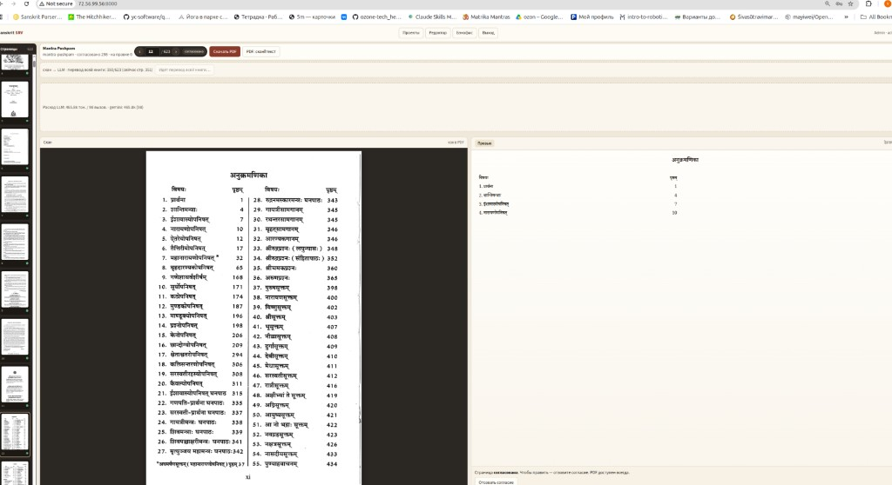
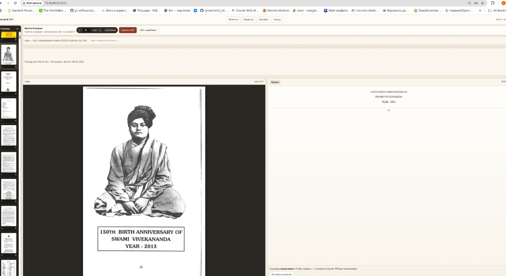

# Руководство пользователя

Практическая инструкция по **Sanskrit SRV** (alpha): от сверки скана до выверенного PDF.

Установка и пользователи сервера — в [руководстве администратора](admin-guide.md). Обзор проекта — в [`README.md`](../README.md).

Документ дополняется по замечаниям при проверке alpha. Ниже — то, что есть в интерфейсе сейчас.

---

## 1. Вход и роли

| Роль | Что видно |
|------|-----------|
| **admin** | Загрузка PDF, проекты, бэкофис (пользователи, каталог LLM) |
| **expert** | Проекты, редактор: скан ‖ текст, задания LLM, согласование |
| **scholar** | То же по правке страниц (задания / филологические директивы) |
| **reader** | В alpha почти не используется |

Войдите по email и паролю (учётку выдаёт администратор). В шапке:

| Пункт | Что это |
|-------|---------|
| **Проекты** | Список книг; отсюда открывают книгу (клик по карточке) |
| **Редактор** | Экран сверки: скан ‖ превью/HTML, конвейер, PDF. Тот же экран, куда вы попадаете, открыв проект. Без выбранного проекта — возврат к списку |
| **Бэкофис** | Только admin: пользователи и каталог LLM |

---

## 2. Проект и конвейер

### Загрузить книгу (admin)

1. **Проекты** → форма «Загрузить PDF-скан».
2. Укажите **slug** (латиница, дефисы), **название**, при желании название на деванагари.
3. Выберите PDF → **Загрузить PDF**.
4. Если страниц больше 100 — подтвердите перевод всей книги (долго и расходнее по LLM).

После загрузки запускается конвейер: нарезка сканов → черновик HTML по страницам.

### Карточка проекта (список «Проекты»)

На карточке книги, например:

`PDF 623 · согласовано 298 · на правке 0`

| Элемент | Значение |
|---------|----------|
| **PDF N** | Число страниц в исходном PDF |
| **согласовано N** | Сколько страниц **во всей книге** приняты (`expert_done`) |
| **на правке N** | Сколько страниц с черновиком ждут правки (`expert_review`) |

Это **счётчики по книге**, не номер текущей страницы.

### Пока идёт перевод

- Следите за полосой **«Конвейер»** (см. таблицу элементов ниже).
- Слева появляются миниатюры сканов по мере готовности.
- **Расход LLM** — токены и оценка стоимости по проекту.
- Пока страница в очереди (`pending` / черновик ещё пуст), правка недоступна — ждите HTML.

**Не** нажимайте **Перевести всю книгу заново**, пока идёт обычный прогон: это полный перезапуск и перетрёт уже нормальные страницы.

Когда конвейер завершится — можно спокойно сверять и править.

---

## 3. Редактор страницы

### Элементы интерфейса (сверху вниз)

Пример шапки открытой книги:

`Mantra Pushpam`  
`mantra-pushpam · согласовано 298 · на правке 0`  
`‹  33 / 623  ›` **согласовано** · **Скачать PDF** · **PDF: скан‖текст**  
`скан → LLM · перевод всей книги: 600/623 (сейчас стр. 601)`

| Где | Что видно | Значение |
|-----|-----------|----------|
| Заголовок | название книги (`Mantra Pushpam`) | Заголовок проекта |
| Подзаголовок | `slug · согласовано N · на правке M` | **Сводка по всей книге**: slug; сколько страниц согласовано; сколько на правке. **N и M — не номер текущей страницы** |
| Пейджер | `‹` / `›` | Предыдущая / следующая страница |
| Пейджер | **`33 / 623`** | **Текущая страница / всего страниц** в книге. Поле слева можно ввести номер и перейти |
| Бейдж у пейджера | **согласовано** / **на правке** / `pending`… | **Статус только открытой** страницы (той, чей номер в пейджере). Не путать со счётчиком «согласовано N» в подзаголовке |
| **Скачать PDF** | кнопка | Собрать PDF из текущего HTML всех страниц |
| **PDF: скан‖текст** | кнопка | PDF: страница скана, затем текстовая, по очереди |
| Полоса конвейера | `… 600/623 (сейчас стр. 601)` | Прогресс **автоперевода** (extract → LLM): сколько страниц уже обработано конвейером / всего; какая страница в работе сейчас. Это **не** число согласованных |
| **Перевести всю книгу заново** | кнопка (admin) | Полный перезапуск конвейера по всем страницам |
| **Расход LLM** | полоса | Токены, вызовы, оценка $ по проекту |
| Слева, «Страницы» | миниатюры + число | Навигация по сканам; число — сколько страниц уже есть в проекте |
| Кружок на миниатюре | зелёный / жёлтый / серый | Статус **этой** страницы (см. ниже) |
| Панель **Скан** | изображение | Исходная страница PDF |
| Вкладки **Превью** / **HTML** | справа | Просмотр черновика / правка исходника HTML |

Как соотносятся цифры из примера:

| Цифра | Смысл |
|-------|--------|
| **33 / 623** | Вы смотрите страницу 33 из 623 |
| **согласовано** (бейдж) | Страница 33 принята |
| **согласовано 298** | Во всей книге принято 298 страниц (в т.ч. возможно страница 33) |
| **на правке 0** | Ни одна страница сейчас не в режиме правки |
| **600/623** | Конвейер перевёл 600 страниц; идёт (или шла) стр. 601 |

**33 и 298 не связаны арифметически** — первое это «где вы», второе это «сколько уже принято по книге».

### Раскладка рабочей зоны

| Слева | Справа |
|-------|--------|
| **Скан** — как в исходном PDF | **Превью** HTML или вкладка **HTML** (исходник) |

### Статусы страницы

У каждой миниатюры справа внизу **цветной кружок**; тот же смысл — у бейджа рядом с `N / M`:

| Кружок / бейдж | Смысл |
|----------------|--------|
| **Зелёный** / **согласовано** | Текст принят (`expert_done`); правка скрыта, пока не отзовёте согласие |
| **Жёлтый** / **на правке** | Есть черновик, согласие отозвано или страница ждёт правки (`expert_review`) |
| **Серый** / `pending`, `extracting`, `llm_draft`… | Ещё в очереди или в работе конвейера |

После авточерновика страница по умолчанию становится **согласовано**; чтобы править — **Отозвать согласие**.

### Кнопки справа внизу (когда страница «на правке»)

| Кнопка | Когда использовать |
|--------|---------------------|
| **Отправить задание** | Есть конкретное замечание (см. use cases ниже) |
| **Пересмотри страницу** | Полный пересмотр по скану без своего текста (или с текстом из поля) |
| **Сохранить правку** | Сохранить правки в HTML без согласования |
| **Сохранить и согласовать** | Страница принята (`expert_done`) |

Если страница уже согласована — видна только кнопка **Отозвать согласие**. После отзыва снова появляются инструменты правки.

### PDF

| Кнопка | Результат |
|--------|-----------|
| **Скачать PDF** | Книга из текущего HTML (типографика и классы стиля уже в черновиках) |
| **PDF: скан‖текст** | Чередование: страница скана, затем текстовая страница |

Отдельной кнопки «подогнать стиль» нет: стиль задаётся при переводе/пересмотре (классы вроде `page-style`, `type-*`, `lh-*`, `narrow`) и попадает в PDF при скачивании. Уже готовые страницы сами не переверстываются — нужен точечный пересмотр.

---

## 4. Use cases

### UC-1. Обычная сверка страницы

1. Дождаться окончания конвейера (или хотя бы этой страницы).
2. Открыть страницу: скан слева, превью справа.
3. Мелкие опечатки — вкладка **HTML** или правка через задание.
4. **Сохранить и согласовать**.

### UC-1a. HTML «сломан» flex/float, не по строкам скана

Симптом: в HTML есть `style="display:flex"`, `float:left/right`, шапка в одну CSS-строку, а на скане — обычные строки друг под другом.

1. **Отозвать согласие** (если согласовано).
2. Задание, например:

   > Убери весь inline CSS (flex/float/style). Сверстай построчно классами narrow/shloka/indent/centered/running-head/page-num как на скане. Каждая печатная строка — свой тег.

3. **Отправить задание** или **Пересмотри страницу**.
4. Сверить превью со сканом → **Сохранить и согласовать**.

### UC-2. Страница согласована, но нашлась ошибка

1. **Отозвать согласие**.
2. Исправить вручную (**Сохранить правку**) или через **Отправить задание** / **Пересмотри страницу**.
3. Снова **Сохранить и согласовать**.
4. При необходимости заново **Скачать PDF**.

### UC-3. Две вертикальные колонки — переведена только левая (или часть)

Типичный сбой: на скане два столбца текста, в HTML попала только левая колонка (иногда обрезанная). Страница при этом может уже быть **согласована** (как ниже) — правка откроется после отзыва согласия.

Примеры (Mantra Pushpam, оглавление / अनुक्रमणिका). Страница уже **согласована** — внизу только **Отозвать согласие**.

Только левая колонка в превью (правая на скане есть, в тексте нет):

Ещё хуже — обрезан даже низ левой колонки (на скане полный список в двух столбцах, в превью лишь первые пункты):

**Что делать** (точечно, не всю книгу):

1. Дождаться конца текущего конвейера (можно смотреть страницы раньше, но массовую правку удобнее после).
2. Открыть проблемную страницу.
3. Если «согласовано» → **Отозвать согласие**.
4. В поле «Замечание / задание» явно написать, например:

   > На скане две вертикальные колонки текста. Восстанови **весь** текст **обеих** колонок слева направо. Правую колонку тоже включи. Не обрывай страницу на середине левой колонки.

5. **Отправить задание** (предпочтительнее, чем пустой «Пересмотри» — модель лучше следует явной директиве).
6. Сверить превью со сканом. Если снова обрезано — повторить задание, уточнив («правая колонка начинается со слова …»).
7. **Сохранить и согласовать**. Пройти так по списку номеров страниц.
8. В конце — **Скачать PDF**.

Не используйте **Перевести всю книгу заново** только из‑за нескольких колоночных страниц.

### UC-4. Нужен PDF «как книга» со стилем

1. Убедиться, что нужные страницы переведены и по возможности согласованы.
2. **Скачать PDF** — в файл попадут текущие HTML и классы вёрстки.
3. Для сверки «глаз на глаз» со сканом — **PDF: скан‖текст**.

Если вёрстка конкретной страницы плохая (узкая колонка растянута, неверный интерлиньяж) — отзыв согласия → задание вроде «сохрани узкую колонку и плотность строк как на скане» → снова PDF.

### UC-5. Посмотреть расход LLM

В редакторе проекта полоса **«Расход LLM»**: токены, число вызовов, оценка $. Как считается расход — в [руководстве администратора](admin-guide.md) (§7).

### UC-6. На скане портрет / иллюстрация, в превью только подпись

**Да, такие картинки можно** включить в HTML и в обычный PDF. Сервис умеет:

1. **Кроп со скана** — LLM (или задание) ставит  
   `<figure class="scan-crop" data-box="x,y,w,h"></figure>`  
   (доли страницы 0–1); сервер вырезает PNG и подставляет `` в превью и в PDF.
2. **Встроенная картинка из PDF** — если в файле отдельный image-объект (не весь лист-скан) → ``.
3. **Без вырезания** — кнопка **PDF: скан‖текст**: целая страница скана чередуется с текстом (портрет остаётся на стороне скана).

Частый сбой: в превью есть только подпись («150TH BIRTH ANNIVERSARY…»), портрет не попал в HTML.

**Что делать:**

1. **Отозвать согласие** (если страница согласована).
2. Задание, например:

   > На скане сверху портрет (фото). Вставь его кропом:  
   > `<figure class="scan-crop" data-box="0.15,0.08,0.70,0.55"></figure>`  
   > (подправь координаты по глазу), подпись оставь под картинкой. Не кропай всю страницу целиком.

3. **Отправить задание** → проверить превью (должна появиться картинка) → согласовать → **Скачать PDF**.

Ограничения: нельзя оформить *весь* лист одним `scan-crop` (это запрещено промптом — иначе дублируется весь скан). Крупный портрет + подпись — нормально. Если нужен «как в книге один в один» без возни с кропом — достаточно **PDF: скан‖текст**.

---

## 5. Чего избегать

| Действие | Почему |
|----------|--------|
| Править во время активного полного конвейера «на глаз» и путаться в статусах | Страница может ещё не получить финальный черновик |
| **Перевести всю книгу заново** из‑за 5–10 плохих страниц | Лишний расход и риск затереть хорошее |
| Ждать отдельную кнопку «стиль» | Стиль уже в HTML; обновляется пересмотром + новым PDF |
| Короткие задания вроде «исправь» без указания на скан | Лучше: что именно не так и что должно быть (колонки, пропуск, таблица…) |

---

## 6. Куда писать новые сценарии

При разборе ошибки на alpha добавляйте сюда блок **UC-N**:

1. Симптом (скан / превью).
2. Шаги в UI (кнопки дословно).
3. Пример текста задания для LLM (если нужно).
4. Чего не делать.
