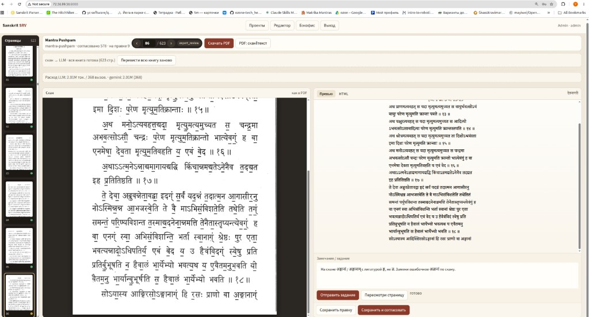

# Руководство пользователя

Практическая инструкция по **Sanskrit SRV** (beta): оцифровка скана, перевод на русский, транслитерация IAST, выверенный PDF/DOCX.

Установка, бэкофис и кабинет с точки зрения сервера — в [руководстве администратора](admin-guide.md). Обзор проекта — в [`README.md`](../README.md).

---

## 1. Вход и роли

| Роль | Что видно |
|------|-----------|
| **admin** | Загрузка PDF, проекты, редактор, **Кабинет**, **Бэкофис** |
| **expert** | Проекты, редактор, **Кабинет** (профиль и ключи LLM) |
| **scholar** | То же по правке страниц и кабинету |
| **reader** | В beta почти не используется |

Войдите по **email или логину** и паролю (учётку выдаёт администратор). По умолчанию эксперт работает на маршруте и ключах бэкофиса; свои ключи — в **Кабинете**.

| Пункт | Что это |
|-------|---------|
| **Проекты** | Список книг; отсюда открывают книгу (клик по карточке). Три типа: оцифровка, перевод на русский, IAST |
| **Редактор** | Сверка страницы: скан или санскрит ‖ черновик ‖ задание, конвейер, PDF/DOCX. Без выбранного проекта — возврат к списку |
| **Кабинет** | Личный кабинет: профиль, ключи LLM, свой расход токенов (см. ниже) |
| **Бэкофис** | Только admin: пользователи, маршрут LLM, каталог моделей, расход по проектам и ключам |

### Кабинет

Три блока.

**Профиль.** Логин и email — для входа; имя видно в шапке. Чтобы сменить email или пароль, укажите текущий пароль.

**Ключи LLM.**

- Если администратор разрешил токены бэкофиса — галочка **Использовать токены и модель бэкофиса** (и кнопка **Вернуться к токенам бэкофиса**).
- Свои ключи: Timeweb AI Gateway (ключ + модель из списка со зрением) и/или ProxyAPI. Сохранение своего ключа Timeweb снимает галочку бэкофиса и переключает сеть на Timeweb — маршрут администратора (часто Gemini) больше не перебивает ваш ключ. Модель ProxyAPI задаётся в бэкофисе, блок «Маршрут LLM».
- Пустое поле ключа при сохранении — «не менять».

**Мой расход токенов.** Только ваши вызовы; свой ключ отдельно от токенов бэкофиса.

Если токены бэкофиса вам закрыты и своих ключей нет, кнопки LLM в редакторе не сработают — нужен ключ в кабинете или разрешение администратора.

---

## 2. Проект и конвейер

Типы проектов:

| Проект | Как появляется | Слева | Справа / центр |
|--------|----------------|-------|----------------|
| **Оцифровка** | Admin загружает PDF | Скан | HTML деванагари |
| **Перевод на русский** | В оцифровке → **Перевод на русский** | Выверенный санскрит | Русский по шаблону |
| **Транслитерация IAST** | В оцифровке → **Транслитерация IAST** | Выверенный санскрит | IAST по шаблону |

Правка санскрита слева в переводе или IAST пишется в оцифровку **новой версией**. К оцифровке возвращает кнопка **← К оцифровке**.

### Загрузить книгу (admin)

1. **Проекты** → форма «Загрузить PDF-скан».
2. Укажите **slug** (латиница, дефисы), **название**, при желании название на деванагари.
3. Выберите PDF → **Загрузить PDF**.
4. Если страниц больше порога (`LARGE_BOOK_PAGES`, по умолчанию 10) — подтвердите оцифровку всей книги (долго и расходнее по LLM).

После загрузки запускается конвейер: нарезка сканов → черновик HTML по страницам.

### Карточка проекта (список «Проекты»)

На карточке книги, например:

`PDF 623 · согласовано 298 · на правке 0`

| Элемент | Значение |
|---------|----------|
| **PDF N** | Число страниц в исходном PDF |
| **согласовано N** | Сколько страниц **во всей книге** приняты (`expert_done`) |
| **на правке N** | Сколько страниц с черновиком ждут правки (`expert_review`) |

Это **счётчики по книге**, не номер текущей страницы.

### Пока идёт конвейер

- Следите за полосой **«Конвейер»** (см. таблицу элементов ниже).
- Слева появляются миниатюры сканов по мере готовности.
- **Расход LLM** — токены и оценка стоимости по проекту.
- Пока страница в очереди (`pending` / черновик ещё пуст), правка недоступна — ждите HTML.

**Не** запускайте новый массовый прогон, пока идёт текущий конвейер. Кнопки **Оцифровать / Перевести / Транслитерировать несогласованные** не трогают уже согласованные страницы, но накладывать два прогона незачем.

Когда конвейер завершится — можно спокойно сверять и править.

---

## 3. Редактор страницы

### Элементы интерфейса (сверху вниз)

Пример шапки открытой книги:

`Mantra Pushpam`  
`mantra-pushpam · согласовано 298 · на правке 0`  
`‹  33 / 623  ›` **согласовано** · **Скачать PDF** · **PDF: скан‖текст**  
`скан → LLM · перевод всей книги: 600/623 (сейчас стр. 601)`

| Где | Что видно | Значение |
|-----|-----------|----------|
| Заголовок | название книги (`Mantra Pushpam`) | Заголовок проекта |
| Подзаголовок | `slug · согласовано N · на правке M` | **Сводка по всей книге**: slug; сколько страниц согласовано; сколько на правке. **N и M — не номер текущей страницы** |
| Пейджер | `‹` / `›` | Предыдущая / следующая страница |
| Пейджер | **`33 / 623`** | **Текущая страница / всего страниц** в книге. Поле слева можно ввести номер и перейти |
| **Поиск** | поле **Найти в черновике** рядом с пейджером (Ctrl+F) | Подстрока по черновикам всей книги (в переводе и IAST — ещё и санскрит слева). Список совпадений под полем; клик открывает страницу. Esc — сбросить |
| Бейдж у пейджера | **согласовано** / **на правке** / `pending`… | **Статус только открытой** страницы (той, чей номер в пейджере). Не путать со счётчиком «согласовано N» в подзаголовке |
| **Скачать PDF** | кнопка | Собрать PDF из текущего HTML всех страниц |
| **PDF: скан‖текст** | кнопка | PDF: страница скана, затем текстовая, по очереди |
| Полоса конвейера | `… 600/623 (сейчас стр. 601)` | Прогресс **конвейера** (extract → LLM): сколько страниц уже обработано / всего; какая страница в работе сейчас. Это **не** число согласованных |
| **Оцифровать несогласованные** | кнопка (admin, оцифровка) | Повторный прогон только страниц **без согласия**. Согласованные не перезаписываются |
| **Перевести несогласованные** / **Транслитерировать несогласованные** | полоса шаблона сверху | Массовый LLM-перевод или IAST. Только несогласованные. На панели страницы — «Перевести страницу» / «Транслитерировать страницу» |
| **Проверить несогласованные** | кнопка (перевод на русский) | Второй проход по несогласованным: грубые обрывы правятся, тонкие замечания помечаются на миниатюре |
| **Шаблон** | кнопка в полосе шаблона | Открывает заметки/промпт; после **Сохранить шаблон** поле скрывается |
| **Голос** | список + кнопка в полосе шаблона (только перевод) | Именованный стиль профессора: создать, вставить эталоны, обновить карточку. Переносится между проектами того же домена |
| **Расход LLM** | полоса | Токены, вызовы, оценка $ по проекту |
| Слева, «Страницы» | миниатюры + число | Навигация по сканам; число — сколько страниц уже есть в проекте |
| Фильтр | **только несогласованные** | Только **вид списка** миниатюр (скрывает согласованные). Стрелки ‹ › ходят по видимым. Массовые LLM-кнопки и так не трогают согласованные |
| Кружок на миниатюре | зелёный / жёлтый / серый | Статус **этой** страницы (см. ниже) |
| Панель **Скан** / **Санскрит** | слева | Оцифровка: страница PDF. Перевод / IAST: выверенный санскрит (**Превью** / **HTML**). Правка HTML санскрита пишется в оцифровку **новой версией** (бэкап в истории) |
| **Превью** / **Текст** / **HTML** | центр (перевод / IAST) или справа (оцифровка) | Черновик страницы; сохранить и согласовать здесь же. В IAST на **Текст**: **Правка по IAST** и **Правка оцифровки** |
| **Задание** / **Справочник** | отдельная панель | Замечание модели, смысловая проверка, копирование знаков деванагари |

Как соотносятся цифры из примера:

| Цифра | Смысл |
|-------|--------|
| **33 / 623** | Вы смотрите страницу 33 из 623 |
| **согласовано** (бейдж) | Страница 33 принята |
| **согласовано 298** | Во всей книге принято 298 страниц (в т.ч. возможно страница 33) |
| **на правке 0** | Ни одна страница сейчас не в режиме правки |
| **600/623** | Конвейер перевёл 600 страниц; идёт (или шла) стр. 601 |

**33 и 298 не связаны арифметически** — первое это «где вы», второе это «сколько уже принято по книге».

### Раскладка рабочей зоны

**Оцифровка:** слева скан, справа превью (вкладки **Превью** / **Текст** / **HTML**). Задание модели и **Справочник** — отдельная панель под превью.

**Перевод и IAST:** три колонки — слева выверенный санскрит (**Превью** / **HTML**), в центре черновик и кнопки сохранить/согласовать, справа **Задание** и **Справочник**. Правка санскрита слева (вкладка **HTML**) пишется в оцифровку **новой версией**: сначала снимок текущего HTML, затем новая версия. Если страница оцифровки была согласована, согласие снимается. В режиме **Текст** проекта IAST: **Правка по IAST** обновляет деванагари по вручную выправленным строкам IAST (оцифровку не трогает); **Правка оцифровки** записывает выправленный санскрит в исходник с бэкапом в истории.

На **Текст** или **HTML** черновика соседние панели уезжают из вида, чтобы место заняла рабочая. Вернуть их: **‹ Санскрит** (или **‹ Скан**), **Задание ›**, либо вкладка **Превью**. Правка HTML санскрита слева так же разворачивает левую панель (**Черновик ›**).

Полоса шаблона (перевод / IAST): тип шаблона и английские комментарии всегда видны; большое поле заметок — только по кнопке **Шаблон**, закрывается после **Сохранить шаблон**.

| Слева | Центр (перевод / IAST) / справа (оцифровка) | Справа (перевод / IAST) |
|-------|---------------------------------------------|-------------------------|
| **Скан** или **Санскрит** (+ **HTML**) | Вкладки **Превью** / **Текст** / **HTML** | **Задание** и **Справочник** |

### Вкладка «Справочник»

Нужна, когда в задании или в HTML надо вставить **точный** деванагари-знак (анусвара, лигатура, вирама), а с клавиатуры его нет или легко перепутать.

**Как пользоваться**

1. Откройте страницу в редакторе (скан слева).
2. На панели **Задание** переключитесь на **Справочник**.
3. Клик по ячейке копирует **только деванагари** (верхний крупный знак). Подпись IAST — подсказка, в буфер не попадает.
4. Вставьте (**Ctrl+V**) туда, куда правите:
   - в поле **«Замечание / задание»** — чтобы модель или сервер видели правильные символы;
   - во вкладку **HTML** — ручная правка исходника.
5. Вернитесь на **Превью**, чтобы сверить результат со сканом.

После клика внизу экрана должно появиться «Скопировано: …». Если сайт открыт по обычному HTTP (не HTTPS), копирование всё равно работает через запасной механизм браузера.

**Что внутри**

| Блок | Зачем |
|------|--------|
| **Гласные** | Самостоятельные अ आ इ … अं अः |
| **Матрā** | Знаки на согласной: ा ि … плюс **ं** (анусвара), **ँ**, ведийский **ꣳ**, **ः**, вирама **्** |
| **Ведийские тоны** | **॑** (сверху) и **॒** (снизу) — вставлять *после* слога; готовые **य॑ य॒** … |
| **Согласная + анусвара** | Готовые слоги **कं गं हं** … и **हꣳ** — удобно для слов вроде **एकहंसः** |
| **Согласные** | По варгам (ङ ञ ण न и т.д.) с IAST |
| **Частые лигатуры** | **ङ्ग** / **ज्ञ**, **क्ष**, **त्र**, **हंस** и др.; у части ячеек короткая пометка («не ज्ञ») |

**Типичный сценарий**

1. На скане **एकहंसः**, в превью ошибочно **एकहंगसः**.
2. **Справочник** → клик **हं** или **हंस** (или отдельно **ं**).
3. В задании наберите, вставляя символы из буфера:

   > получилось एकहंगसः исправь на एकहंसः

4. **Отправить задание**. При такой формулировке сервер может заменить строку в HTML сразу, без LLM.

**Формулировки, которые сервер правит без LLM** (ошибочное слово должно буквально быть в HTML):

| Задание | Результат |
|---------|-----------|
| `получилось X исправь на Y` | X → Y |
| `исправь X на Y` / `замени X на Y` | X → Y |
| `в WORD вместо A вставь B` | в WORD все A заменяются на B |
| `вместо A вставь B в WORD` | то же |

Пример: `в इत्युपैष्यहं вместо ष вставь म` → **इत्युपैम्यहं**.

Не копируйте «похожий» знак с другой варги (ङ вместо न, ज्ञ вместо ङ्ग) — сверяйте со сканом и с подписью IAST.

### Статусы страницы

У каждой миниатюры справа внизу **цветной кружок**; тот же смысл — у бейджа рядом с `N / M`:

| Кружок / бейдж | Смысл |
|----------------|--------|
| **Зелёный** / **согласовано** | Текст принят (`expert_done`); правка скрыта, пока не отзовёте согласие |
| **Жёлтый** / **на правке** | Есть черновик, согласие отозвано или страница ждёт правки (`expert_review`) |
| **Серый** / `pending`, `extracting`, `llm_draft`… | Ещё в очереди или в работе конвейера |

После авточерновика страница по умолчанию становится **согласовано**; чтобы править — **Отозвать согласие**.

### Кнопки справа внизу (когда страница «на правке»)

| Кнопка | Когда использовать |
|--------|---------------------|
| **Отправить задание** | Есть конкретное замечание (см. use cases ниже) |
| **Пересмотри страницу** / **Оцифровать страницу** | Полный пересмотр по скану (на оцифровке без HTML кнопка называется «Оцифровать страницу») |
| **Перевести страницу** / **Транслитерировать страницу** | Один проход LLM по открытой странице (перевод или IAST) |
| **Слить эту шлоку** | Только перевод: пустое поле под каждым русским абзацем — вставить вариант профессора и слить с черновиком Gemini |
| **В голос** | Рядом со слиянием: записать текущую пару SA+RU в выбранный голос |
| **Смысловая проверка** | Второй проход: модель предлагает правки (подсветка в превью); эксперт отмечает что принять / отклонить и жмёт «Применить выбранные». На **переводе** сравнивает русский с санскритом и стык с соседними страницами, без скана |
| **Сохранить правку** | Сохранить правки в HTML без согласования |
| **Сохранить и согласовать** | Страница принята (`expert_done`) |

Если страница уже согласована — видна только кнопка **Отозвать согласие**. После отзыва снова появляются инструменты правки.

### PDF / DOCX

На проекте **оцифровки** (скан ‖ санскрит):

| Кнопка | Результат |
|--------|-----------|
| **Скачать PDF** | Книга из текущего HTML (типографика и классы стиля уже в черновиках) |
| **PDF: скан‖текст** | Чередование: страница скана, затем текстовая страница |
| **Скачать DOCX** | То же содержимое в Word (`.docx`) |
| **DOCX: скан‖текст** | То же чередование скан ‖ текст в Word |

На проекте **перевода на русский** и **IAST** те же **Скачать PDF** и **Скачать DOCX** (HTML страниц → файл). Кнопки «скан‖текст» скрыты — слева не скан, а санскрит.

Shift+клик по любой из кнопок — пересобрать файл заново (иначе отдаётся последний собранный). PDF большой книги собирается в фоне: в интерфейсе будет «Собираем PDF…», затем скачается.

Отдельной кнопки «подогнать стиль» нет: стиль задаётся при переводе/пересмотре (классы вроде `page-style`, `type-*`, `lh-*`, `narrow`) и попадает в PDF/DOCX при скачивании. Уже готовые страницы сами не переверстываются — нужен точечный пересмотр.

---

## 4. Use cases

### UC-1. Обычная сверка страницы

1. Дождаться окончания конвейера (или хотя бы этой страницы).
2. Открыть страницу: скан слева, превью справа.
3. Мелкие опечатки — вкладка **HTML** (знаки удобно брать из **Справочник**) или правка через задание.
4. **Сохранить и согласовать**.

### UC-1a. HTML «сломан» flex/float, не по строкам скана

Симптом: в HTML есть `style="display:flex"`, `float:left/right`, шапка в одну CSS-строку, а на скане — обычные строки друг под другом.

1. **Отозвать согласие** (если согласовано).
2. Задание, например:

   > Убери весь inline CSS (flex/float/style). Сверстай построчно классами narrow/shloka/indent/centered/running-head/page-num как на скане. Каждая печатная строка — свой тег.

3. **Отправить задание** или **Пересмотри страницу**.
4. Сверить превью со сканом → **Сохранить и согласовать**.

### UC-1b. Хвост страницы: обрыв или подмена последнего слова (ङ्ग → ज्ञ)

Модель **часто лажает в конце** абзаца/страницы:

| Тип сбоя | Пример |
|----------|--------|
| **Подмена лигатуры** | на скане **अङ्गानां** (ङ्ग), в превью ложное **अज्ञानां** (ज्ञ) |
| **Обрыв** | последние слова или строки скана не попали в HTML |
| **Укорочение окончания** | अङ्गानाम् → अङ्गानां / обрезка хвоста слога |

Пример (Mantra Pushpam, стр. ~86): скан заканчивается на **अङ्गानां**, превью — **अज्ञानां**; в задании уже указано исправление.



**Что делать:**

1. Если «согласовано» → **Отозвать согласие**.
2. В поле задания явно (лучше со словом со скана):

   > На скане последнее слово **अङ्गानां** / **अङ्गानाम्** с лигатурой **ङ्ग**, не **ज्ञ**. Замени ошибочное **अज्ञानां** по скану. Дочитай абзац до конца — без обрыва последних слов.

3. **Отправить задание** (для точечной правки хвоста предпочтительнее пустого «Пересмотри»).
4. Сверить **именно конец** превью со сканом → **Сохранить и согласовать**.

При сверке всегда смотрите **последнюю строку** страницы: там чаще всего обрыв или «похожее» неверное слово (ङ्ग/ज्ञ, ङ/ञ/ण/न).

### UC-1f. Смысловая проверка (предложения с выбором)

Когда черновик в целом есть, но возможны обрывы («пропал **र**», слово потеряло смысл):

1. Страница **на правке** (не согласована).
2. **Смысловая проверка** — модель смотрит скан + HTML и возвращает список `ошибочное → правка` с краткой причиной.
3. В превью спорные места **подсвечены**; в списке у каждого предложения галочка.
4. Снимите галочки с того, что отклоняете (ведические «странные» написания по словарю чинить нельзя — если модель ошиблась, просто не принимайте).
5. **Применить выбранные** — в HTML попадают только отмеченные замены. Остальное можно закрыть без изменений.

Это не полная перевёрстка страницы (в отличие от «Пересмотри»); правки точечные.

### UC-1d. Анусвара vs лишняя ग (एकहंगसः → एकहंसः)

Симптом: на скане **एकहंसः** / **एकहꣳसः** (анусвара на **ह**, затем **स**), в тексте **एकहंगसः** (лишняя **ग** / «нг»).

Задание (знаки **हं** / **ं** / **ꣳ** — из вкладки **Справочник**, см. выше):

> получилось एकहंगसः исправь на एकहंसः

Если в задании есть точная пара «получилось X исправь на Y», сервер сначала делает **прямую замену** в HTML (без LLM). Иначе уходит в пересмотр моделью.

### UC-1d2. Ведийское «гум» / словарь правит знакомое слово

Симптом: на скане **गणपतिग्ं** / **ऋतग्ं** (полуформа **ग्** + анусвара), в черновике **गणपतिं** / **ऋतं** — модель подставила «словарную» анусвару. Обратное тоже плохо: обычную **ं** на пластине нельзя массово менять на **ग्ं**.

Если уже испортилось:

> получилось गणपतिं исправь на गणपतिग्ं  
> получилось ऋतं исправь на ऋतग्ं  
> (если наоборот наплодила гум) получилось …ग्ं исправь на …ं по скану

### UC-1e. Точечная замена буквы в слове (ष → म)

Симптом: модель не слышит формулировку вроде «вставь म вместо ष» и оставляет слово как было.

Рабочие формулировки задания (знаки из **Справочник**):

> в इत्युपैष्यहं вместо ष вставь म

или целиком:

> получилось इत्युपैष्यहं исправь на इत्युपैम्यहं

Сервер сам строит **इत्युपैष्यहं → इत्युपैम्यहं** и правит HTML без LLM, если ошибочное слово есть на странице. Затем **Отправить задание** и сверить превью.

### UC-1f. Ведийские тоны (॑ ॒)

По умолчанию **черновик без тонов**: у модели слишком много ложных ॑/॒, поэтому сервер **счищает** эти знаки из ответа LLM. Нужные акценты — вручную из **Справочник → Ведийские тоны** или заданием с явной парой (тогда тоны в задании не вычищаются):

> получилось यज्ञेन исправь на य॒ज्ञेन॑

### UC-1c. В превью английский текст («The user wants me…») вместо санскрита

Симптом: справа не HTML страницы, а рассуждение модели на английском; иногда ещё цепочка **ऽऽऽऽ** и обрыв.

1. **Отозвать согласие** при необходимости.
2. Задание:

   > Предыдущий ответ — не HTML, а комментарий. Выдай только `<article class="page-style …">` с текстом страницы по скану, без английских пояснений. Дочитай до конца, без обрыва и без повторов ऽ.

3. **Пересмотри страницу** или **Отправить задание**.
4. Если снова мусор — повторить; после выкладки фикса валидатор должен сам отбрасывать такой ответ и брать запасную модель.

### UC-2. Страница согласована, но нашлась ошибка

1. **Отозвать согласие**.
2. Исправить вручную (**Сохранить правку**) или через **Отправить задание** / **Пересмотри страницу**.
3. Снова **Сохранить и согласовать**.
4. При необходимости заново **Скачать PDF**.

### UC-3. Две вертикальные колонки — переведена только левая (или часть)

Типичный сбой: на скане два столбца текста, в HTML попала только левая колонка (иногда обрезанная). Страница при этом может уже быть **согласована** (как ниже) — правка откроется после отзыва согласия.

Примеры (Mantra Pushpam, оглавление / अनुक्रमणिका). Страница уже **согласована** — внизу только **Отозвать согласие**.

Только левая колонка в превью (правая на скане есть, в тексте нет):


Ещё хуже — обрезан даже низ левой колонки (на скане полный список в двух столбцах, в превью лишь первые пункты):


**Что делать** (точечно, не всю книгу):

1. Дождаться конца текущего конвейера (можно смотреть страницы раньше, но массовую правку удобнее после).
2. Открыть проблемную страницу.
3. Если «согласовано» → **Отозвать согласие**.
4. В поле «Замечание / задание» явно написать, например:

   > На скане две вертикальные колонки текста. Восстанови **весь** текст **обеих** колонок слева направо. Правую колонку тоже включи. Не обрывай страницу на середине левой колонки.

5. **Отправить задание** (предпочтительнее, чем пустой «Пересмотри» — модель лучше следует явной директиве).
6. Сверить превью со сканом. Если снова обрезано — повторить задание, уточнив («правая колонка начинается со слова …»).
7. **Сохранить и согласовать**. Пройти так по списку номеров страниц.
8. В конце — **Скачать PDF**.

Не запускайте массовую оцифровку несогласованных только из‑за нескольких колоночных страниц — правьте точечно.

### UC-4. Нужен PDF «как книга» со стилем

1. Убедиться, что нужные страницы переведены и по возможности согласованы.
2. **Скачать PDF** — в файл попадут текущие HTML и классы вёрстки.
3. Для сверки «глаз на глаз» со сканом — **PDF: скан‖текст**.

Если вёрстка конкретной страницы плохая (узкая колонка растянута, неверный интерлиньяж) — отзыв согласия → задание вроде «сохрани узкую колонку и плотность строк как на скане» → снова PDF.

### UC-5. Посмотреть расход LLM

В редакторе проекта полоса **«Расход LLM»**: токены, число вызовов, оценка $. Как считается расход — в [руководстве администратора](admin-guide.md) (§7).

### UC-6. На скане портрет / иллюстрация, в превью только подпись

**Да, такие картинки можно** включить в HTML и в обычный PDF. Сервис умеет:

1. **Кроп со скана** — LLM (или задание) ставит  
   `<figure class="scan-crop" data-box="x,y,w,h"></figure>`  
   (доли страницы 0–1); сервер вырезает PNG и подставляет `` в превью и в PDF.
2. **Встроенная картинка из PDF** — если в файле отдельный image-объект (не весь лист-скан) → ``.
3. **Без вырезания** — кнопка **PDF: скан‖текст**: целая страница скана чередуется с текстом (портрет остаётся на стороне скана).

Частый сбой: в превью есть только подпись («150TH BIRTH ANNIVERSARY…»), портрет не попал в HTML.


**Что делать:**

1. **Отозвать согласие** (если страница согласована).
2. Задание, например:

   > На скане сверху портрет (фото). Вставь его кропом:  
   > `<figure class="scan-crop" data-box="0.15,0.08,0.70,0.55"></figure>`  
   > (подправь координаты по глазу), подпись оставь под картинкой. Не кропай всю страницу целиком.

3. **Отправить задание** → проверить превью (должна появиться картинка) → согласовать → **Скачать PDF**.

Ограничения: нельзя оформить *весь* лист одним `scan-crop` (это запрещено промптом — иначе дублируется весь скан). Крупный портрет + подпись — нормально. Если нужен «как в книге один в один» без возни с кропом — достаточно **PDF: скан‖текст**.

### UC-7. Смысловая проверка перевода на русский

После массового перевода типичны: обрыв русской строки на шлоке, стык «конец стр. N / начало N+1» не сходится, реже — опечатка в деванагари (она пришла со сверки скана).

1. Страница **на правке** (не согласована), справа есть русский черновик.
2. **Смысловая проверка** на этой странице — модель смотрит санскрит слева, перевод справа и хвост предыдущей / голову следующей страницы. Список `ошибочное → правка` с причиной, как в UC-1f. Метки: **обрыв**, **стык стр.**, **санскрит**, **смысл**.
3. Грубые (**high**, обычно обрыв перевода) лучше принять; тонкие снимите, если это ложная тревога или ведийское написание.
4. **Применить выбранные**. Правка санскрита с меткой «слева» меняет левую колонку и записывается в оцифровку **новой версией** (старый HTML остаётся в истории). Если страница оцифровки была согласована — согласие снимается.

Чтобы пройти **несогласованные** страницы книги: кнопка **Проверить несогласованные**. Грубые обрывы правятся сразу; тонкие замечания остаются в списке (на миниатюре — число). Согласованные массовая проверка не переписывает: отзовите согласие и примените выбранные.

Не путать с **Перевести несогласованные** — то полный перевод заново, но только страниц без согласия.

### UC-8. Транслитерация IAST

1. В проекте **оцифровки** (желательно после сверки санскрита) → **Транслитерация IAST**.
2. Выберите шаблон: **Шлока + блок IAST** или **Только IAST**; английские комментарии убрать или оставить; при необходимости заметки к шаблону.
3. **Создать проект IAST**. Дальше как перевод: слева деванагари, справа IAST.
4. **Транслитерировать страницу** или **Транслитерировать несогласованные**. Согласованные страницы не перезапишутся.
5. Шаблон правится кнопкой **Шаблон** → **Сохранить шаблон**.
6. Правка IAST в режиме **Текст**. Если из-за ошибки оцифровки IAST не совпадает со строкой деванагари — выправьте IAST и нажмите **Правка по IAST**: деванагари пересчитается по этой строке. Оцифровка пока не меняется.
7. Когда деванагари на странице верный (после «Правка по IAST» или правки вручную) — **Правка оцифровки**. Текущий HTML страницы оцифровки сначала копируется в историю (бэкап), затем записывается новая версия; согласие на оцифровке снимается, если страница была согласована. То же делает правка санскрита слева на вкладке **HTML** + **Сохранить**.
8. **Скачать PDF** / **Скачать DOCX**.

### UC-9. Слияние двух переводов одной шлоки

На странице перевода у каждого русского абзаца (шлока, заголовок, строка комментария) появляется **пустое зелёное поле**. Туда вставляют второй вариант — обычно перевод профессора. Кнопка **Слить эту шлоку** собирает гибрид с текущим черновиком (часто Gemini) и подменяет **только эту** русскую строку.

Пустые поля в HTML черновика **не пишутся**: это накладка интерфейса. Согласованная страница полей не показывает — сначала **Отозвать согласие**.

#### Что уходит в модель

1. Выверенный санскрит страницы (левая колонка).
2. Текущий черновик целиком (вариант **A**).
3. Текст из зелёного поля плюс деванагари этой шлоки (вариант **B**). Если вставка похожа на одну шлоку, модели явно сказано вернуть **только эту пару**, а не всю страницу.

#### Как выбирается «лучшее»

Модель не копирует целиком ни A, ни B. Жёсткий порядок:

1. Каждое слово оригинала должно быть в русской строке тегом `(IAST)`; добавленное только в `[квадратных скобках]`.
2. Грамматика: падеж, число, наклонение. Оптатив вроде `saṃcarvyatām` → «да смакуется», не изъявительное «вкушается».
3. Сложения по членам: `jīvat-śivatvam` → «состояние Шивы при жизни», не «живой Шива».
4. Термины кашмирского шиваизма, если корень это позволяет: āgama → агама (не «писание»), śakti → Шакти (не «Сила»).
5. Читаемое русское предложение без ремарок «буквально…» и без таблиц разбора.
6. Если грамматика одинакова — более естественная русская связка (часто из A).

Пример ॥ ४ ॥: у профессора точнее грамматика и термины, у Gemini ровнее фраза; в гибриде остаются «невыразимый», агамы, Шакти, «да смакуется», «при жизни».

#### Как результат сажается на страницу

Ответ модели — HTML одной (или нескольких) русских строк. Сервер ищет в черновике ту же шлоку по номеру `॥ n ॥` и по деванагари, в том числе внутри `<div class="shloka">`. Совпавшую `<p class="ru">` заменяет, **остальные абзацы не трогает**.

Если сопоставить не удалось (нет номера, другой текст) — черновик **не меняется**, на экране ошибка, а не урезанная страница. Успешное слияние пишется новой версией в историю (как «Перевести страницу»).

#### Что делать

1. Страница **на правке**.
2. В поле **под нужной шлокой** вставить перевод профессора (можно без HTML).
3. **Слить эту шлоку** (1–2 минуты).
4. Сверить строку → при необходимости **Смысловая проверка** или правка вручную → **Сохранить и согласовать**.

Не вставляйте в одно поле всю страницу профессора, если правите одну шлоку: одна шлока — одно зелёное поле.

### UC-10. Голос переводчика (память стиля профессора)

**Зачем.** Слияние (UC-9) правит одну шлоку «здесь и сейчас». *Голос* — именованная память стиля (карточка + эталоны), которую можно **подключить к другому проекту** того же домена (например кашмирский шиваизм). Стили разных переводчиков не смешиваются: у каждого свой голос.

Голос хранится в БД отдельно от проекта (`voices` / `voice_examples`). Проект только ссылается: `settings.translation.voice_id`.

#### Пример: сформировать голос «Профессор X»

1. Откройте проект перевода с шаблоном **Пословно: рус. (IAST)** (кашмирский шиваизм).
2. В полосе шаблона: список **Голос** → **Голос** (панель).
3. Имя `Профессор X`, slug `professor-x`, домен **кашмирский шиваизм** → **Создать**. Голос сразу привязывается к проекту.
4. Наполните эталонами одним из способов:
   - **После слияния:** под шлокой **Слить эту шлоку** → сверить гибрид → **В голос** (пишет текущую пару SA+RU).
   - **Пакетом** в панели голоса (блоки через `===`):

```text
SA:
धीमन्दराचलवलत्परमागमाब्धे-
रुल्लास्यते किमपि यत्परमामृतं तत् ।
जीवच्छिवत्वमधिगन्तुममुत्र सद्भिः
संचर्व्यतामविरतं परशक्तिपूतैः ॥ ४ ॥
RU:
Тот (tat) невыразимый (kim api) высший нектар (paramāmṛtam), что (yat) извлекается (ullāsyate) из океана высших агам (paramāgama-abdheḥ) [с помощью] разума (dhī), вращаемого (valat) подобно горе Мандаре (mandarācala), да смакуется (saṃcarvyatām) непрестанно (aviratam) благими (sadbhiḥ), очищенными (pūtaiḥ) Высшей Шакти (para-śakti), дабы достичь (adhigantum) в нём (amutra) состояния Шивы (śivatvam) при жизни (jīvat).
===
SA:
…следующая эталонная шлока…
RU:
…эталонный русский…
```

5. **Добавить эталоны** (при пакетной вставке карточка обновляется сразу) или **Обновить карточку** — из глосс `(IAST)` собирается лексикон (`āgama` → агама, `śakti` → Шакти и т.д.) плюс базовые правила грамматики/фразы.

Карточка — мягкая: формат `iast_gloss` не ломается; уточняются термины и привычки этого переводчика внутри домена.

#### Пример: применить на других страницах / в другом проекте

1. **Та же книга:** голос уже выбран → **Перевести страницу** / **Перевести несогласованные**. В промпт уходят карточка + 2–4 эталона, отобранных по пересечению деванагари/IAST с текущей страницей (лёгкий «RAG» без векторов).
2. **Другая книга того же домена:** создайте/откройте проект перевода → в списке **Голос** выберите `Профессор X` (сохраняется в шаблоне проекта). Дальше перевод и слияние опираются на ту же память.
3. **Слияние с живой вставкой:** если под шлокой есть текст профессора (B), он важнее карточки при явном конфликте; голос подсказывает термины, когда B молчит.

Не ждите, что голос «кашмирского» профессора подойдёт к веданте или другому автору: смените голос или домен. Заметки шаблона (**Шаблон**) — отдельный жёсткий текст эксперта; их не путать с голосом.

---

## 5. Чего избегать

| Действие | Почему |
|----------|--------|
| Править во время активного полного конвейера «на глаз» и путаться в статусах | Страница может ещё не получить финальный черновик |
| Массовый прогон из‑за 5–10 плохих страниц | Лишний расход; лучше точечное задание. Согласованные массовые кнопки и так не затирают |
| Ждать отдельную кнопку «стиль» | Стиль уже в HTML; обновляется пересмотром + новым PDF |
| Короткие задания вроде «исправь» без указания на скан | Лучше: что именно не так и что должно быть (колонки, пропуск, таблица…) |

---

## 6. Куда писать новые сценарии

При разборе ошибки добавляйте сюда блок **UC-N**:

1. Симптом (скан / превью).
2. Шаги в UI (кнопки дословно).
3. Пример текста задания для LLM (если нужно).
4. Чего не делать.
